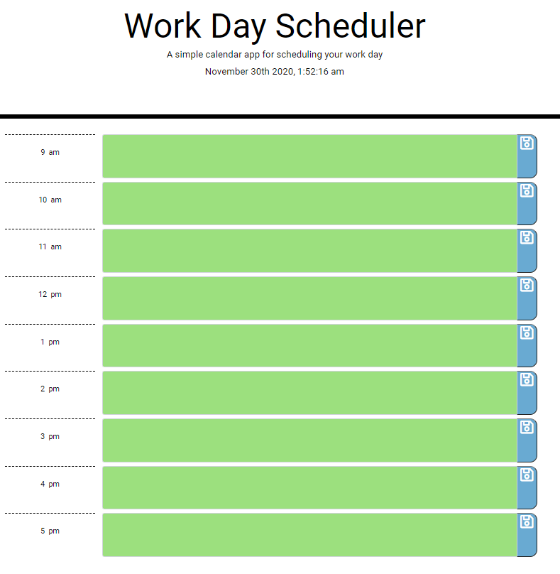

# Day Scheduler

## User Story

AS AN employee with a busy schedule

I WANT to add important events to a daily planner

SO THAT I can manage my time effectively

## Screenshot of Deployed Application

;

## Tasks

I created a simple calendar application that allows a user to save events for each hour of the day by modifying starter code. This app will run in the browser and feature dynamically updated HTML and CSS powered by jQuery.

## Functionality

The app should display standard business hours (9 a.m. to 5 p.m.). Each time slot should represent one hour and contain the following:

* The time

* A field to hold user input

* A save button

* The current day is displayed at the top of the calendar

* Each timeblock is color coded to indicate whether it is in a past, present, or future hour

* Clicking on the save button will store the time and user input in localStorage

* Near the top of the calendar, the application should display the current day. Additionally, each hour should be color coded to reflect whether the time slot is in the past, the present, or the future. This will change depending on the time of day

## API

You'll need to use the [Moment.js](https://momentjs.com/) library to work with date and time. Be sure to read the documentation carefully and concentrate on using Moment.js in the browser.

## Link to Deployed Application

[Deployable Link Here](https://github.com/Drewski419/Day-Scheduler)